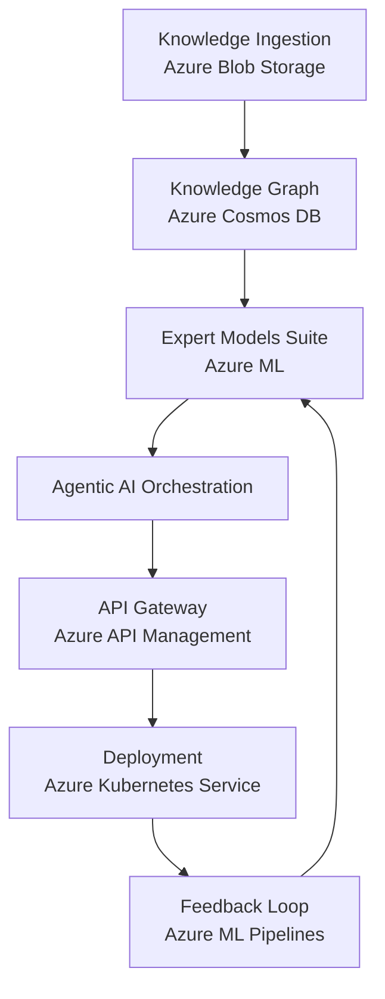

# Architecture Overview

The DBE AI Expert System is built on a distributed Azure-based architecture to ensure high availability, scalability, and robust AI orchestration.

## Architecture Diagram

### Component Details

| Component | Technology | Responsibility |
| :--- | :--- | :--- |
| **Knowledge Ingestion** | Azure Blob Storage | Landing zone for raw data files and unstructured data. |
| **Knowledge Graph** | Azure Cosmos DB | Storing structured relationships and metadata for reasoning. |
| **Expert Models Suite** | Azure ML | Hosting and managing specialized AI models for different domains. |
| **Agentic AI Orchestration** | Custom Logic | The "brain" that determines which expert models to call and how to combine results. |
| **API Gateway** | Azure API Management | External entry point, handling auth, rate limiting, and routing. |
| **Deployment** | AKS | Scalable container orchestration for the entire system. |
| **Feedback Loop** | Azure ML Pipelines | Continuous training and refinement of models based on user interaction. |
